# 🍁 小哈的分靈

這是一個專為私人 Discord 伺服器設計的楓之谷 (Maplestory) 數據查詢機器人。透過整合 Nexon Open API，提供即時、詳細的角色數據分析與歷史紀錄追蹤。

---

## ✨ 功能介紹與指令 (Features & Commands)

本機器人透過指令觸發，一次性整合多個 API 端點的數據。
* **Command:** `/角色資訊_查詢 角色名稱:[角色名稱]`

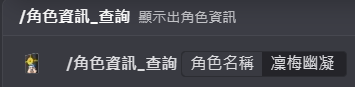

### 1. 角色綜合概況 (Character Profile)
查詢角色的基本素質、戰鬥力、戰地等級、等核心數據。
* **API Endpoints:** `basic`, `dojang`, `stat`, `union`

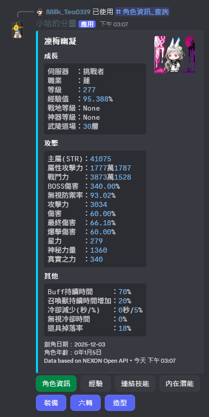

### 2. 經驗歷史 (Exp History)
列出角色近7日的經驗值，30、60、90日以來的經驗總獲得量。
* **API Endpoints:** `basic`

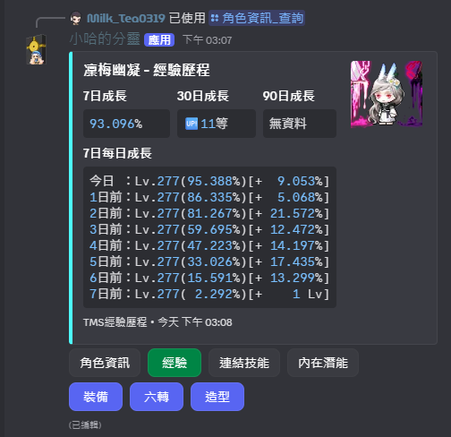

### 3. 連結技能 (Link Skill)
詳細列出角色自身與套用的連結技能。
* **API Endpoints:** `link-skill`

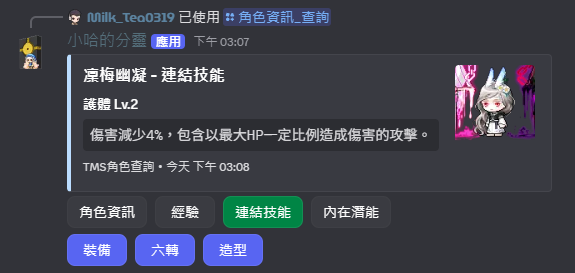

### 4. 內在潛能 (Ability)
詳細列出角色當前穿戴的內在潛能，可切換預設套。
* **API Endpoints:** `ability`

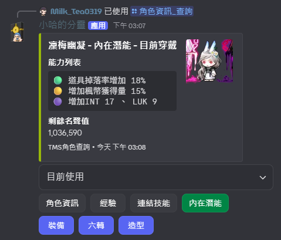

### 5. 裝備 (Equipment)
詳細列出角色當前穿戴的裝備、能力值、潛能，可切換預設套。
* **API Endpoints:** `item-equipment`, `pet-equipment`

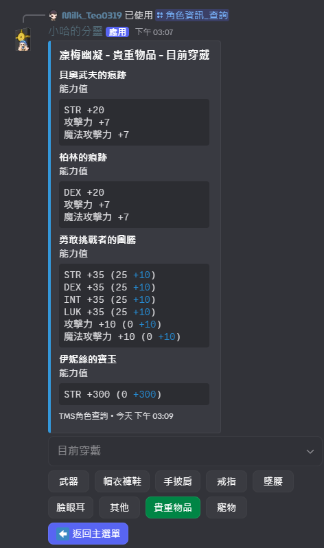

### 6. 六轉 (Hexa)
詳細列出角色的技能、精通、強化、共用核心等級，並計算六轉含共用與不含共用核心的靈魂與碎片進度。

詳細列出角色的屬性核心。
* **API Endpoints:** `hexamatrix`, `hexamatrix-stat`

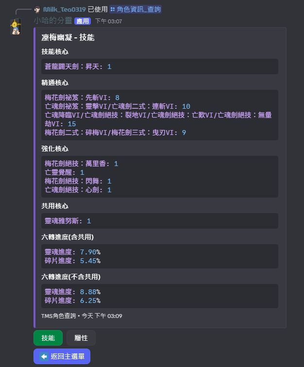

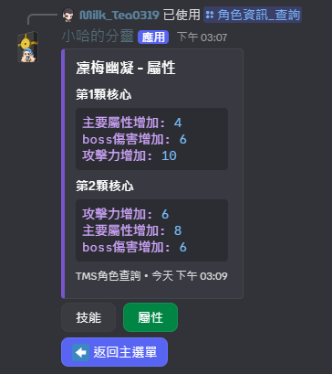

### 7. 造型 (Cashitem)
詳細列出角色當前穿戴的時裝，可切換預設套。

詳細列出角色的髮型、臉型、皮膚。

詳細列出角色的特殊時裝(限定神之子與天使破壞者)。
* **API Endpoints:** `cashitem-equipment`, `beauty_equipment`

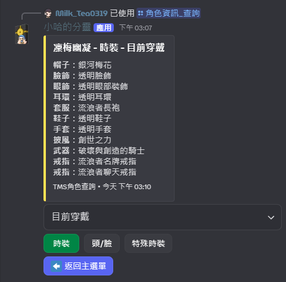

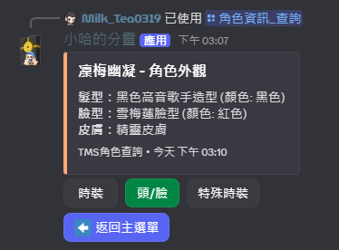

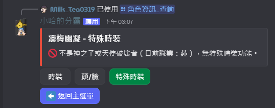

---

## ⚙️ 技術架構 (Technical Info)

* **Language:** Python 3.13
* **Library:** Discord.py
* **Data Source:** NEXON Open API

由於單一查詢指令包含大量數據聚合，**需要較高的瞬間並發請求額度 (Burst Rate)** 以確保回應速度與使用者體驗。

---
*Last Updated: 2026*
